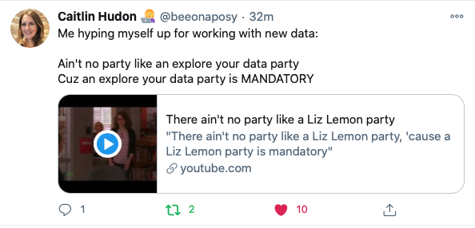

```{r, include = F}
# This is the recommended set up for flipbooks
# you might think about setting cache to TRUE as you gain practice --- building flipbooks from scratch can be time consuming
knitr::opts_chunk$set(fig.width = 6, message = FALSE, warning = FALSE, comment = "", cache = F)

library(flipbookr)
library(tidyverse)
```

## Welcome!

This is a short tutorial that will demonstrate plotting several common types of graphs in R using the `ggplot2` package.

To follow along with the workshop in R, you will need to have **already installed** R and R Studio.

---

## How to follow along and participate

* Open R Studio

    + In R Studio, install the `tidyverse` package using the `Tools` menu and `Install packages...` menu choice 

    + Type the name of the package, `tidyverse`, in the dialog box that opens

* Open the workshop R Markdown file and click on the little green arrow at the top of code chunk that contains this: 

```{r eval = FALSE}
library(package = "tidyverse")
```

* The arrow will run all the code in that "chunk" of code

* Throughout the workshop you will be able to run the code from the demonstration by clicking the arrow on the top right in the corresponding code chunk

* In between code chunks, you can type as you would in a Word document if you'd like to take notes

* For the exercises you may have to finish the code yourself and then click the arrow to get the anticipated result

---

## Why are we doing this?

```{r, echo=FALSE, out.width = 600, fig.align='center'}
   
```

---

## The data set

* We will be using a built-in R data set containing data from Star Wars characters

```{r, echo=FALSE, out.width = 600, fig.align='center'}
   
```

---

## Examine the full data set

* Get to know the data by running the code chunk that contains the name of the data:

```{r}
starwars
```

---

## Exploring the variables in the data set

```{r}
# change data types & subset data set to remove lists
starwarsRec <- starwars %>% 
  mutate_if(is.character, as.factor) %>% 
  select(-films, -vehicles, -starships)

# summarize updated data set
summary(starwarsRec)
```

---

## Using the ggplot2 package for plotting

* Part of the `tidyverse` set of packages in R

* `gg` stands for **grammar** of **graphics**

* Plots created in `ggplot2` are built in layers 

* Let's look at some examples

* First, a bar chart...

---

`r chunk_reveal("my_bar", widths = c(1,1), title = "## Basic bar chart")`

```{r my_bar, include = FALSE}
starwars %>%
  ggplot(aes(x = gender)) +
  geom_bar() 
```

---

`r chunk_reveal("my_bar_fancy", widths = c(1,1), title = "## Fancy bar chart")`

```{r my_bar_fancy, include = FALSE}
starwars %>%
  drop_na(gender) %>% 
  ggplot(aes(x = gender)) +
  geom_bar(fill = "#7463AC") +
  labs(x = "Character Gender",
       y = "Frequency",
       title = "Gender of Star Wars Characters") +
  theme_minimal()
```

---

## You Try it!

Make a bar chart of the Sex of Star Wars Characters with the Figure 1 code in your R Markdown file.

Note that there is a line of recoding to update some out-of-date terminology.

Edit the code to: 

* Change the color of the bars by replacing #7463AC the name of your favorite color (e.g., orange) or using a color found on the <a href = "https://colorbrewer2.org/">https://colorbrewer2.org/</a> website

* Add labels for the axes and a title inside the quote marks

* Try another theme, you can find them here: https://ggplot2.tidyverse.org/reference/ggtheme.html

When you have completed the changes, click the little green arrow on the top right of the code chunk to run the code.

---

## Figure 1 code 

```{r, echo=FALSE, out.width = 600, fig.align='center'}
   knitr::include_graphics('./this-is-the-way.jpg')
```

---

`r chunk_reveal("my_bar_fancy_fig1", widths = c(1,1), title = "## Figure 1 code")`

```{r my_bar_fancy_fig1, include = FALSE}
starwars %>%
  drop_na(sex) %>% 
  mutate(sex = recode_factor(sex,
                             "hermaphroditic" = "intersex")) %>% 
  ggplot(aes(x = sex)) +
  geom_bar(fill = "deeppink") +
  labs(x = "Character Sex",
       y = "Frequency",
       title = "Sex of Star Wars Characters") +
  theme_minimal()
```

---

`r chunk_reveal("my_2var_bar", widths = c(1,1), title = "## Basic stacked bar chart for 2 variables")`

```{r my_2var_bar, include = FALSE}
starwars %>%
  drop_na(sex, gender) %>% 
  mutate(sex = recode_factor(sex,
                             "hermaphroditic" = "intersex")) %>% 
  ggplot(aes(x = gender, fill = sex)) +
  geom_bar() 
```

---

`r chunk_reveal("my_2var_bar_col", widths = c(1,1), title = "## Fancy stacked bar chart for 2 variables")`

```{r my_2var_bar_col, include = FALSE}
starwars %>%
  drop_na(sex, gender) %>% 
  mutate(sex = recode_factor(sex,
                             "hermaphroditic" = "intersex")) %>% 
  ggplot(aes(x = gender, fill = sex)) +
  geom_bar() +
  scale_fill_brewer(palette = 'Set1', name = "Character Sex") +
  labs(x = "Character Gender",
       y = "Frequency",
       title = "Sex and Gender of Star Wars Characters") +
  theme_minimal()
```

---

`r chunk_reveal("my_2var_bar_group1", widths = c(1,1), title = "## Fancy grouped bar chart with color palettes")`

```{r my_2var_bar_group1, include = FALSE}
starwars %>%
  drop_na(sex, gender) %>% 
  mutate(sex = recode_factor(sex,
                             "hermaphroditic" = "intersex")) %>% 
  ggplot(aes(x = gender, fill = sex)) +
  geom_bar(position = "dodge") +
  scale_fill_brewer(palette = 'Set1', name = "Character Sex") + 
  labs(x = "Character Gender",
       y = "Frequency",
       title = "Sex and Gender of Star Wars Characters") +
  theme_minimal()
```

---

`r chunk_reveal("my_2var_bar_group", widths = c(1,1), break_type = "rotate", title = "## Fancy grouped bar chart with color palettes")`

```{r my_2var_bar_group, include = FALSE}
starwars %>%
  drop_na(sex, gender) %>% 
  mutate(sex = recode_factor(sex,
                             "hermaphroditic" = "intersex")) %>% 
  ggplot(aes(x = gender, fill = sex)) +
  geom_bar(position = "dodge") +
  scale_fill_brewer(palette = 'Set1', name = "Character Sex") + #ROTATE
  scale_fill_brewer(palette = 'Dark2', name = "Character Sex") + #ROTATE
  scale_fill_brewer(palette = 'PRGn', name = "Character Sex") + #ROTATE
  labs(x = "Character Gender",
       y = "Frequency",
       title = "Sex and Gender of Star Wars Characters") +
  theme_minimal()
```

---

## You Try it!

Customize the bar chart of the Gender and Hair Color of Star Wars Characters with the Figure 2 code in your R Markdown file.

Edit the code to: 

* Change the color of the bars by replacing the palette with a different palette found on the <a href = "http://www.cookbook-r.com/Graphs/Colors_(ggplot2)/">http://www.cookbook-r.com/Graphs/Colors_(ggplot2)/</a> website (bottom of page)

* Add labels for the axes and a title inside the quote marks

* Try another theme, you can find them here: https://ggplot2.tidyverse.org/reference/ggtheme.html

When you have completed the changes, click the little green arrow on the top right of the code chunk to run the code.

---

## Figure 2 code 

```{r, echo=FALSE, out.width = 600, fig.align='center'}
   knitr::include_graphics('./this-is-the-way.jpg')
```

---

`r chunk_reveal("my_2var_bar_cont", widths = c(1,1), title = "## Figure 2 code")`

```{r my_2var_bar_cont, include = FALSE}
starwars %>%
  drop_na(species, gender) %>% 
  ggplot(aes(x = hair_color, fill = gender)) +
  geom_bar(position = "dodge") +
  scale_fill_brewer(palette = 'Set1', name = "Gender") + 
  labs(x = "Character Hair Color",
       y = "Frequency",
       title = "Hair Color and Gender of Star Wars Characters") +
  theme_bw() 
```

---

`r chunk_reveal("my_2var_bar_cont1", widths = c(1,1), title = "## Add data management to Figure 2 code")`

```{r my_2var_bar_cont1, include = FALSE}
starwars %>%
  drop_na(hair_color, gender) %>% 
  mutate(hair_color = recode_factor(hair_color,
                                    "blond" = "blonde",
                                    "brown, grey" = "multiple",
                                    "auburn, white" = "multiple",
                                    "auburn, grey" = "multiple")) %>% 
  ggplot(aes(x = hair_color, fill = gender)) +
  geom_bar(position = "dodge") +
  scale_fill_brewer(palette = 'Set1', name = "Gender") + 
  labs(x = "Character Hair Color",
       y = "Frequency",
       title = "Hair Color and Gender of Star Wars Characters") +
  theme_minimal() +
  coord_flip()
```

---

`r chunk_reveal("my_2var_bar_means", widths = c(1,1), title = "## Basic means bar chart")`

```{r my_2var_bar_means, include = FALSE}
starwars %>%
  drop_na(height, gender) %>% 
  group_by(gender) %>% 
  summarize(meanHt = mean(height)) %>% 
  ggplot(aes(x = gender, y = meanHt)) +
  geom_col() 
```

---

## You Try it!

* Copy and paste the bar chart code for the Gender and Height of Star Wars Characters to the code chunk for Gender and Mass under the Figure 3 code section in your R Markdown file. 

* Replace "height" with "mass" throughout the code. 

* Add labels for the x and y axes and a title. 

* Use `fill =` inside the parentheses with some color name or number to add a color in the `geom_col()` layer. 

* Add a theme layer with any theme you want to try.

---

## Figure 3 code 

```{r, echo=FALSE, out.width = 600, fig.align='center'}
   knitr::include_graphics('./this-is-the-way.jpg')
```

---

`r chunk_reveal("figure_3", widths = c(1,1), title = "## Figure 3  bar chart option")`

```{r figure_3, include = FALSE}
starwars %>%
  drop_na(mass, gender) %>% 
  group_by(gender) %>% 
  summarize(meanMass = mean(mass)) %>% 
  ggplot(aes(x = gender, y = meanMass)) +
  geom_col(fill = "dodgerblue2") +
  labs(x = "Character Gender",
       y = "Mean Mass (kg)",
       title = "Star Wars Character Mass by Gender") +
  theme_light()
```

---

`r chunk_reveal("my_2var_bar_means_fancy", widths = c(1,1), title = "## Fancy means bar chart")`

```{r my_2var_bar_means_fancy, include = FALSE}
starwars %>%
  drop_na(height, gender) %>% 
  group_by(gender) %>% 
  summarize(meanHt = mean(height),
            sdHt = sd(height)) %>% 
  ggplot(aes(x = gender, y = meanHt)) +
  geom_col(fill = "deeppink") +
  geom_errorbar(aes(ymin = meanHt-sdHt, 
                    ymax = meanHt+sdHt),
                position = position_dodge(width = .9),
                width = .2) +
  labs(x = "Character Gender",
       y = "Mean Height (cm)",
       title = "Mean Height (cm) of Star Wars Characters\nby Gender") +
  theme_minimal(base_size = 14)
```

---

`r chunk_reveal("my_box", widths = c(1,1), title = "## Basic box plot")`

```{r my_box, include = FALSE}
starwars %>%
  drop_na(height, gender) %>% 
  ggplot(aes(x = gender, y = height)) +
  geom_boxplot() 
```

---

`r chunk_reveal("my_box_fancy", widths = c(1,1), title = "## Super fancy layered box plot")`

```{r my_box_fancy, include = FALSE}
starwars %>%
  drop_na(height, gender) %>% 
  ggplot(aes(x = gender, y = height)) +
  geom_violin(aes(color = gender), fill = "white",
              alpha = .8) +
  geom_boxplot(aes(color = gender, fill = gender), 
               alpha = .3) +
  geom_jitter(aes(color = gender), alpha = .4) +
  labs(x = "Character Gender",
       y = "Height (cm)",
       title = "Height (cm) of Star Wars Characters by Gender") +
  scale_color_brewer(palette = "Set2", guide = FALSE) +
  scale_fill_brewer(palette = "Set2", guide = FALSE) +
  theme_minimal(base_size = 14)
```

---

`r chunk_reveal("my_scatter", widths = c(1,1), title = "## Basic scatter plot")`

```{r my_scatter, include = FALSE}
starwars %>%
  drop_na(height, mass) %>% 
  ggplot(aes(x = height, y = mass)) +
  geom_point() 
```

---

`r chunk_reveal("my_scatter_fancy", widths = c(1,1), title = "## Fancy scatter plot")`

```{r my_scatter_fancy, include = FALSE}
starwars %>%
  drop_na(height, mass) %>% 
  ggplot(aes(x = height, y = mass)) +
  geom_point(color = "dodgerblue2") +
  geom_smooth(method = "lm", se = FALSE, 
              color = "orange") +
  labs(x = "Height (cm)",
       y = "Mass (kg)",
       title = "Height and Mass of Star Wars Characters") +
  theme_bw()
```

---

`r chunk_reveal("my_scatter_fancier", widths = c(1,1), title = "## Even fancier scatter plot (without Jabba)")`

```{r my_scatter_fancier, include = FALSE}

starwars %>%
  drop_na(height, mass) %>% 
  filter(mass < 250) %>% 
  ggplot(aes(x = height, y = mass, label = name)) +
  geom_point(color = "dodgerblue2", shape = 18, 
             size = 4, alpha = .6) + 
  geom_smooth(method = "lm", se = FALSE, 
              color = "orange", linetype = "dotdash") +
  labs(x = "Height (cm)",
       y = "Mass (kg)",
       title = "Height and Mass of Star Wars Characters\n(Excludes Jabba)") +
  theme_bw(base_size = 14)

```

---

## The end

```{r, echo=FALSE, out.width = 400, fig.align='center'}
   
```


<!-- adjust font size in this css code chunk, currently 80 -->

```{css, eval = TRUE, echo = FALSE}
.remark-code{line-height: 1.5; font-size: 80%}

@media print {
  .has-continuation {
    display: block;
  }
}

code.r.hljs.remark-code{
  position: relative;
  overflow-x: hidden;
}


code.r.hljs.remark-code:hover{
  overflow-x:visible;
  width: 500px;
  border-style: solid;
}
```


